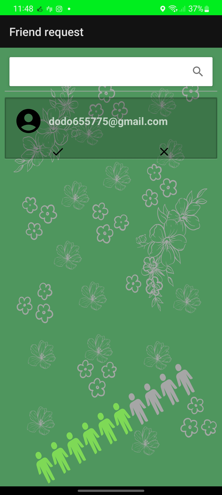
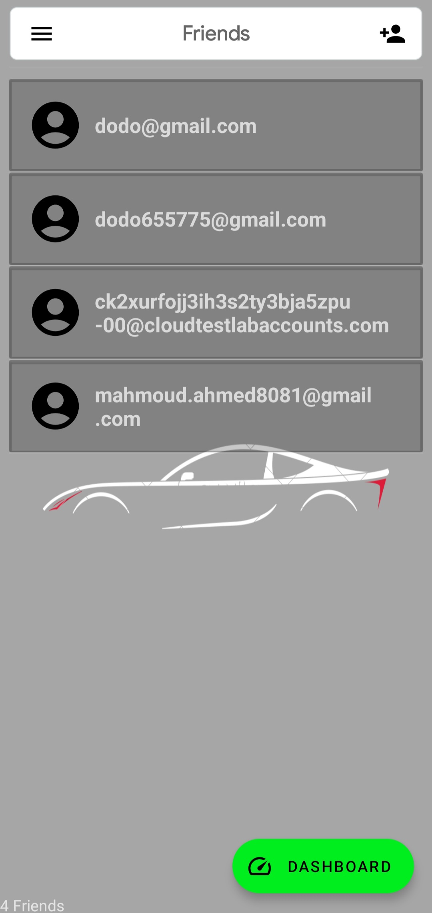
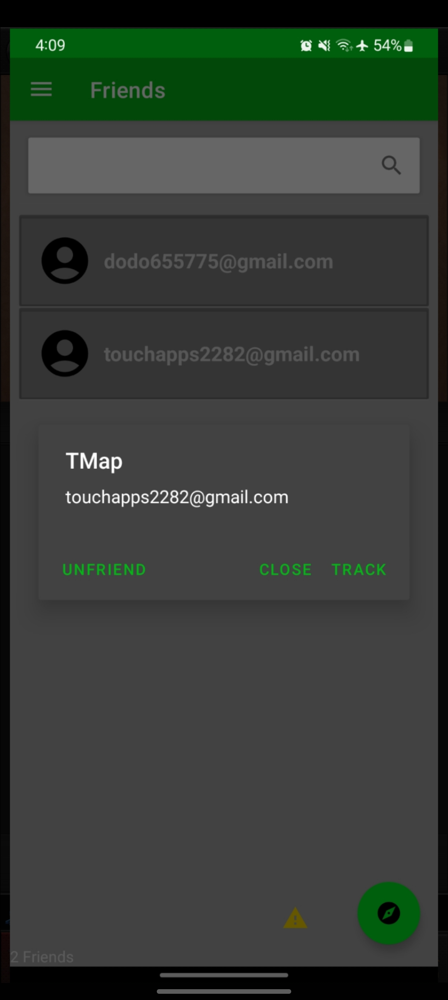
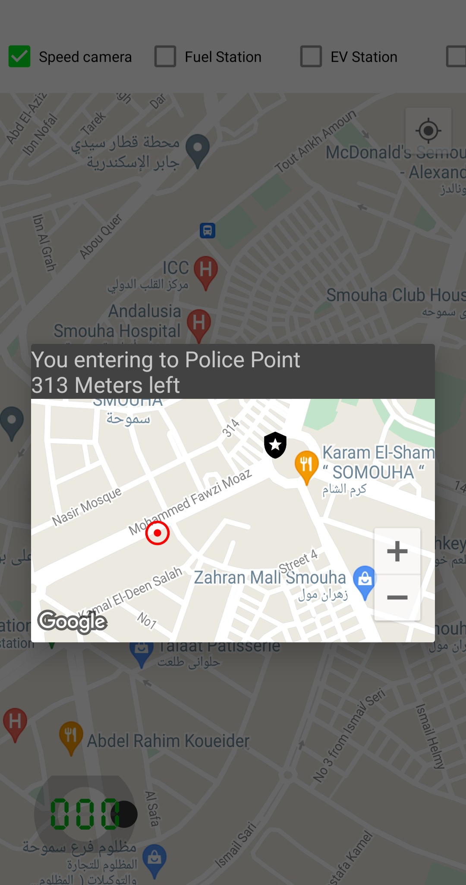
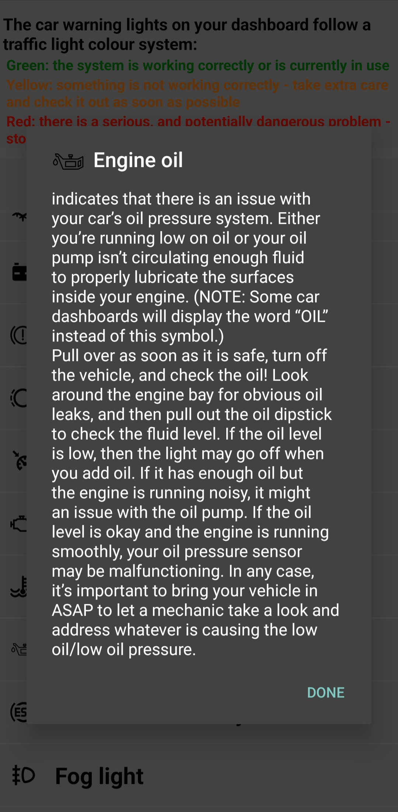
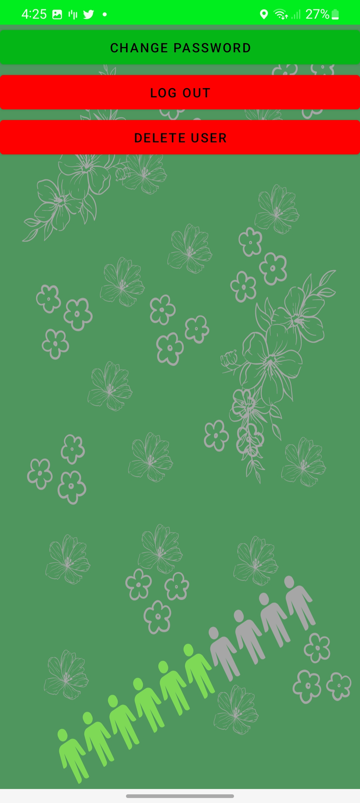

# TouchApps

Firebase Realtime

Firebase Messaging

Google Map

AdMob Integration

In App Purchases

Retrofit

Rest Apis

Arcore (Experimental)

GeoFencing

Support 10+ Languages

Leak Canary (Memory Leak Detection)

Material Design

Google Map

GeoFence

Car Dashboard

